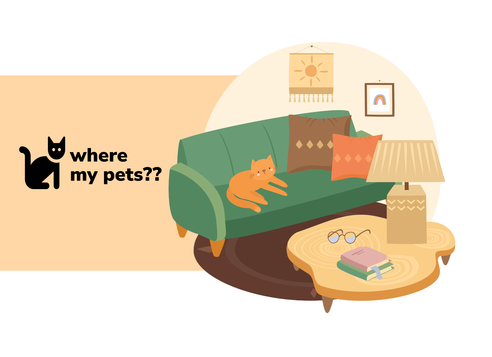

# Where My Pet's

Projek web ini didasari oleh keresahan user ketika hewan pelharaannya hilang. Kita ingin membuat website yang berguna untuk membantu orang mencari hewan peliharaannya yang hilang.

Link Figma : https://www.figma.com/file/DD0gPWylrWM4ZzTst6i7e0/Project-Akhir?type=design&node-id=17%3A209&mode=design&t=BJPY2CG2RTIojF05-1

Link backend: https://wheremypets-backend-production.up.railway.app/docs

Link preview website : https://w22-group-react-group-c.vercel.app/

## Team Member 🤝

---

| Name                    | Role                |
| ----------------------- | ------------------- |
| Immanuel Arya           | Front-End Developer |
| Dandi Rizky Eko Saputro | Fullstack Developer |

## Features

1. Found Pet List

   Fitur merupakan tempat dimana ditemukannya hewan yang terlantar/hilang, sehingga pengguna dapat mencari peliharaannya disini jika merasa kehilangan. Pada fitur ini akan berisi detail berupa nama penemu, lokasi, jenis hewan, kontak, status hewan tersebut dan deskripsi mendetail tentang hewan tersebut. Fitur Found Pet List ini juga menyediakan form bagi pengguna yang ingin membuat postingan baru mengenai hewan yang ditemukan.

2. Find Pet List

   Fitur ini merupakan tempat unutuk pengguna yang merasa kehilangan hewan kesayangannya. Pada fitur ini akan berisi detail berupa nama pemilik, lokasi, jenis hewan, kontak, status hewan tersebut dan deskripsi mendetail tentang hewan tersebut. Fitur Find Pet List menyediakan form bagi pengguna yang ingin membuat postingan baru mengenai kehilangan hewan.

3. Call Center

   Fitur ini merupakan sebuah call center yanh sudah terintegrasi ke platform Whatsapp yang diperuntukkan kepada pengguna yang ingin bertanya mengenai aplikasi Where my Pet's ini.

## Technologies 💻

---

- NestJS
- Swagger
- Typescript
- PrismaORM
- PostgreSQL
- Railway
- NextJS
